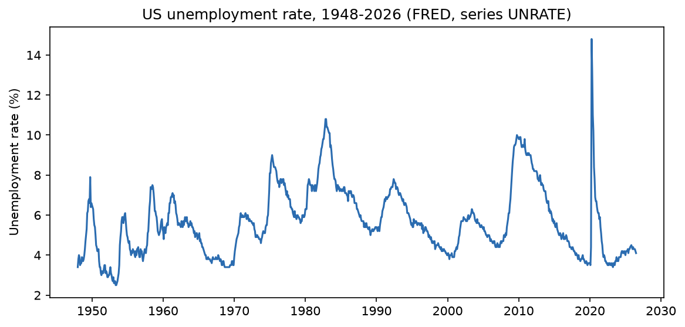
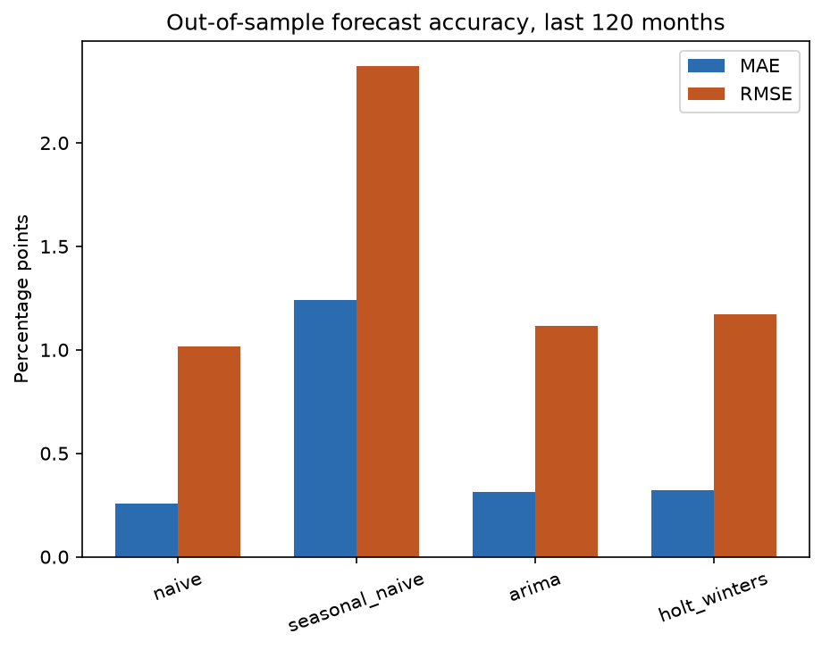
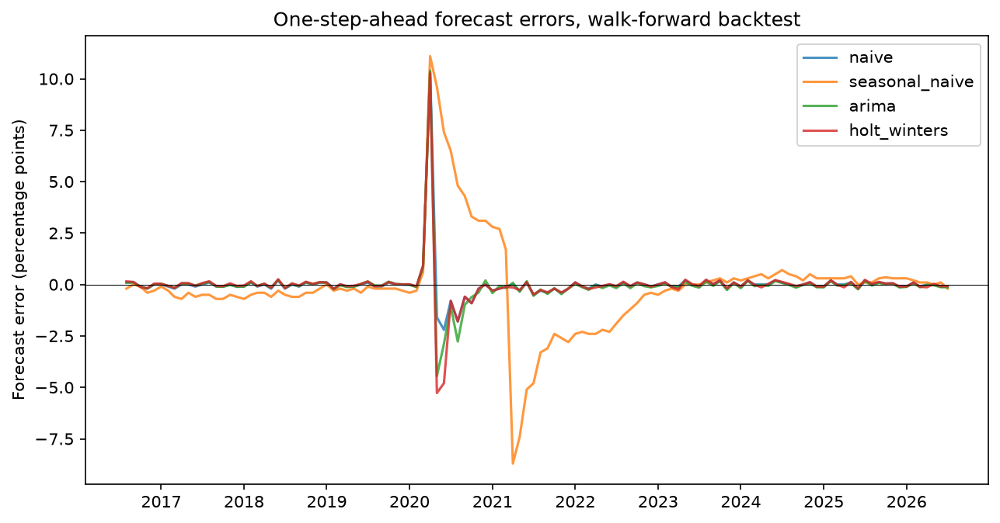

# Time Series Forecasting: Statistically Validated Model Comparison

Four forecasting models compared on real US unemployment data with a proper walk-forward backtest and a formal statistical test for whether any model actually beats the simplest possible baseline.

## Data

Monthly US unemployment rate, 1948-2026 (FRED series UNRATE, fetched directly, no API key required). One month (October 2025) is missing from the published series due to a delayed BLS release during the 2025 government shutdown and is linearly interpolated.



## Method

Four models are compared: a naive random-walk forecast, a seasonal naive forecast (repeats the value from 12 months earlier), Holt-Winters exponential smoothing, and ARIMA. Each is evaluated with a one-step-ahead walk-forward backtest over the last 120 months: at every point, the model is refit on all data up to that point and forecasts only the next month, so no model ever sees the future.

Comparing mean errors alone does not establish that one model is genuinely better, since the difference could be noise. The Diebold-Mariano test (Diebold & Mariano, J. Bus. Econ. Stat. 13(3), 253-263, 1995, with the Harvey-Leybourne-Newbold 1997 small-sample correction) tests the null hypothesis that two models have equal expected squared forecast error, accounting for autocorrelation in the loss differential.

## Results

| Model | MAE | RMSE |
|---|---|---|
| naive | 0.256 | 1.015 |
| seasonal_naive | 1.240 | 2.373 |
| arima | 0.312 | 1.115 |
| holt_winters | 0.320 | 1.170 |



The naive forecast has the lowest error of all four models. This is a real and well-documented phenomenon in short-horizon macroeconomic forecasting: for a persistent series like the unemployment rate, last month's value is a very hard baseline to beat one step ahead.

Diebold-Mariano test against the naive baseline:

| Comparison | DM statistic | p-value | Significant at 5%? |
|---|---|---|---|
| naive vs seasonal_naive | -3.75 | 0.0003 | Yes |
| naive vs arima | -1.42 | 0.16 | No |
| naive vs holt_winters | -1.31 | 0.19 | No |

Seasonal naive is significantly worse than naive: unemployment does not repeat a fixed 12-month pattern closely enough for that assumption to pay off. Neither ARIMA nor Holt-Winters is significantly different from the naive forecast at conventional significance, despite both having higher raw MAE. The honest conclusion is that this backtest does not provide statistical evidence that either model improves on the simplest baseline.

The large RMSE relative to MAE across all four models is driven by a single extreme outlier: the April 2020 COVID-19 unemployment shock, where the rate jumped from 4.4% to 14.7% in one month, producing a forecast error of over 10 percentage points for every model.



## Contents

- `src/models.py`: naive, seasonal naive, Holt-Winters, and ARIMA forecasters behind a common interface
- `src/backtest.py`: walk-forward one-step-ahead backtest
- `src/diebold_mariano.py`: Diebold-Mariano test with the small-sample correction
- `data/fetch_fred_series.py`: reproducible fetch of the real FRED series
- `tests/`: validates each model on synthetic data and the Diebold-Mariano test against known null and clearly-different cases

## Running it

```bash
python -m venv .venv
.venv/bin/pip install -r requirements.txt
.venv/bin/python -m pytest -q
.venv/bin/python -m analysis.run_analysis
```
